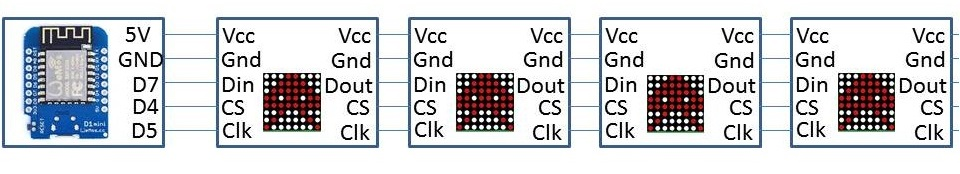

This is a  simple project around Arduino (ESP8266) and Node-RED to display YouTube subsciber counts for a channel. The subsciber count is displayed over 4x MAX7219 based dot matrix display modules. It can not only display the subscriber count, it can display any content.

## Video:-
  
[Information Display System using WeMOS and MAX7219 | MAKE #3](http://bit.ly/2tC3VKs) @[WeArGenius](https://www.youtube.com/channel/UCo3jik11kHu65uQBGueaw4g)

## Dependencies:

1. [MAX7219 Display Library]( http://bit.ly/2oTtoty) for ESP8266 : by [SensorsIot](http://bit.ly/2ocx5fp)

## Wiring:-

The modules are connected to the ESP8266 using the SPI interfaces, the connections are as follows,

